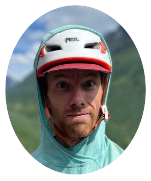

{.hero-headshot fig-align="center"}

## About Me {.cv-header}

::: {.text-align}
Hi, my name is Max Lorsignol.

I am a recent graduate with a Master's degree in Geomatics for Environmental Management from the University of British Columbia. Inspired by my father's mountaineering maps in my younger years and my love for the outdoors, my passion lies in the collection, analysis, and visualization of earths many surfaces and spatial information. I aim to apply my technical skills and field experience to address critical challenges in environmental conservation, climate change mitigation, and sustainable land management, working toward innovative solutions for our changing world. When not developing digital cartographic solutions, I can be found outdoors, exploring the Pacific Northwest's mountains.
:::

## CV {.cv-header}

{.pdf-frame width="100%" height="1050px"}

[Download CV (PDF)](LGEO_resume_no_headshot.pdf){.btn target="_blank"}

## Contact {.contact-header}

::: hero-links
[LinkedIn](https://www.linkedin.com/in/max-lorsignol-bb854595/){.btn .btn-sm target="_blank"} [GitHub](https://github.com/maxlorsignol){.btn .btn-sm target="_blank"} [Email](mailto:maxlorsignol@gmail.com){.btn .btn-sm}
:::
