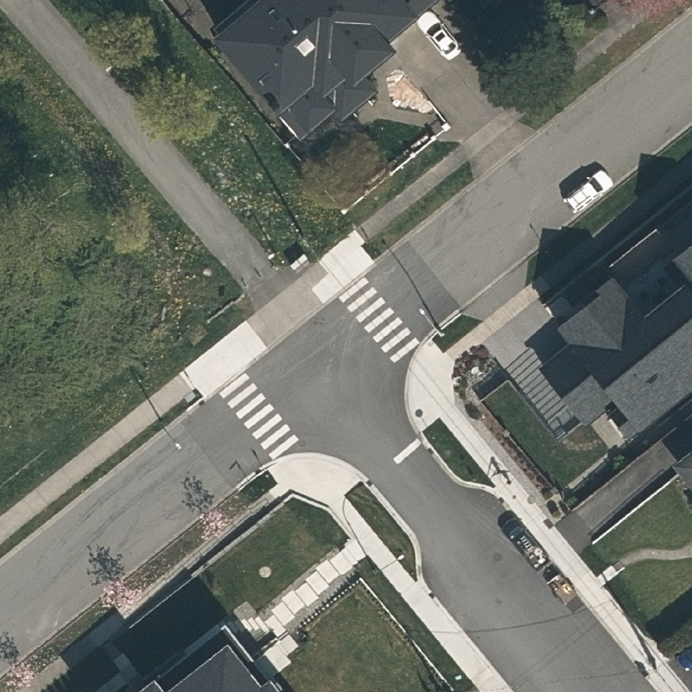
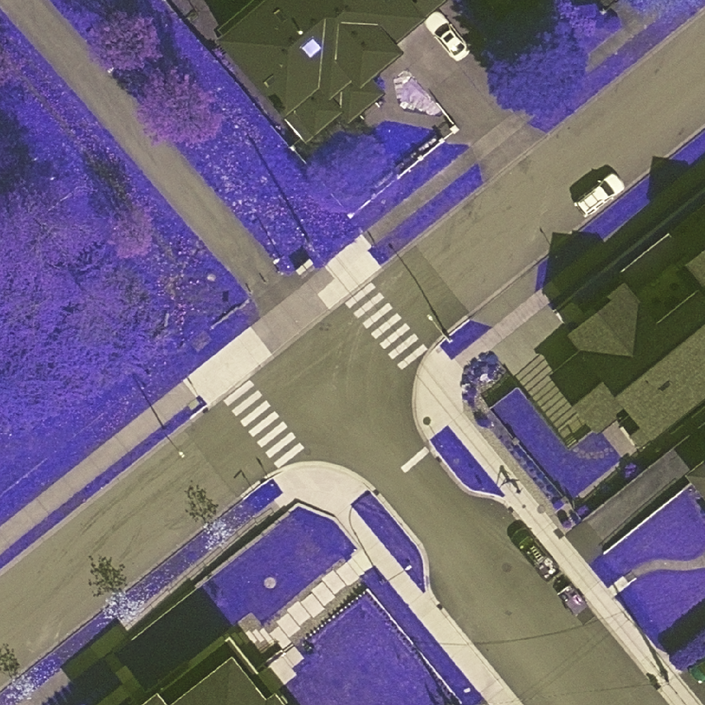
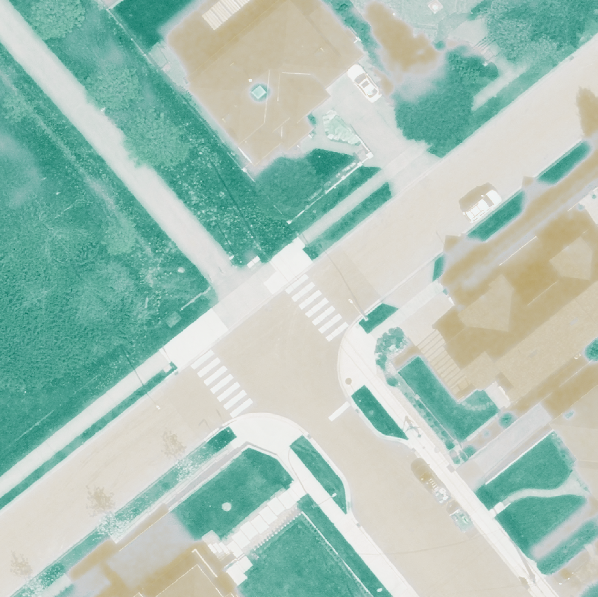
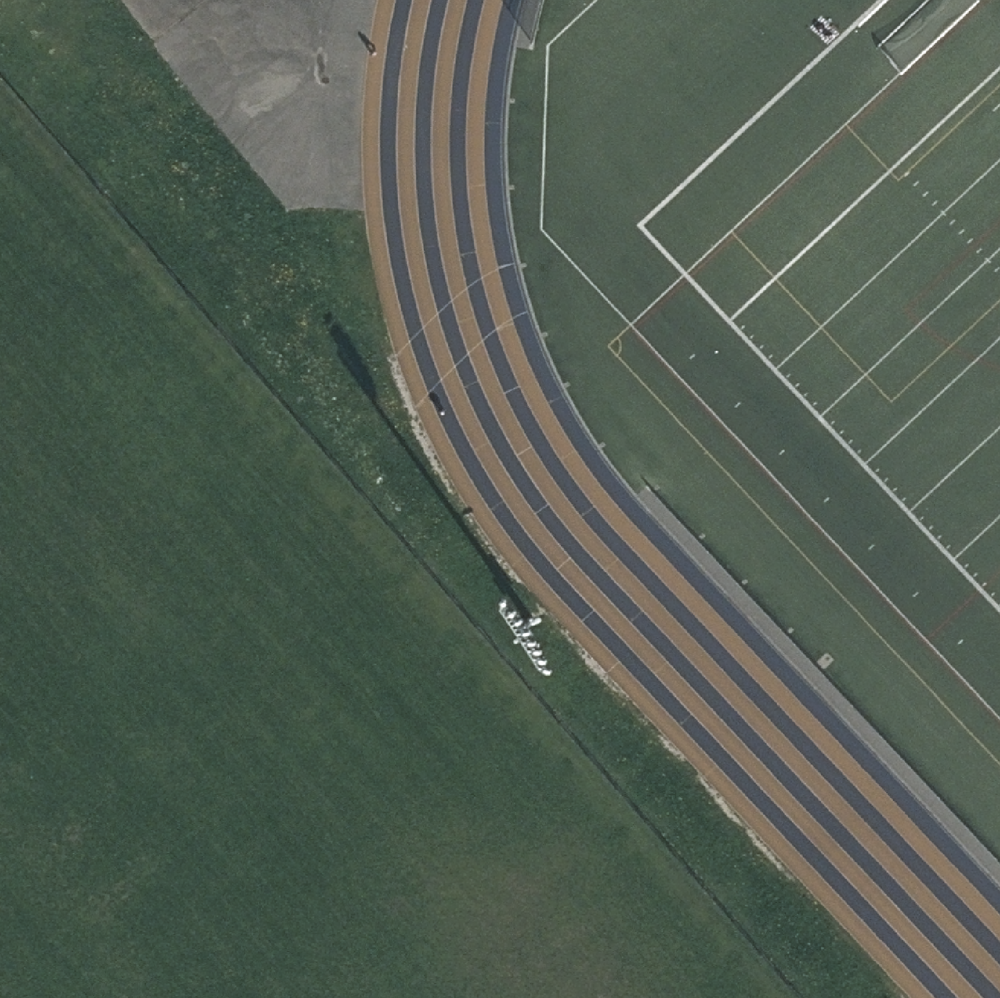
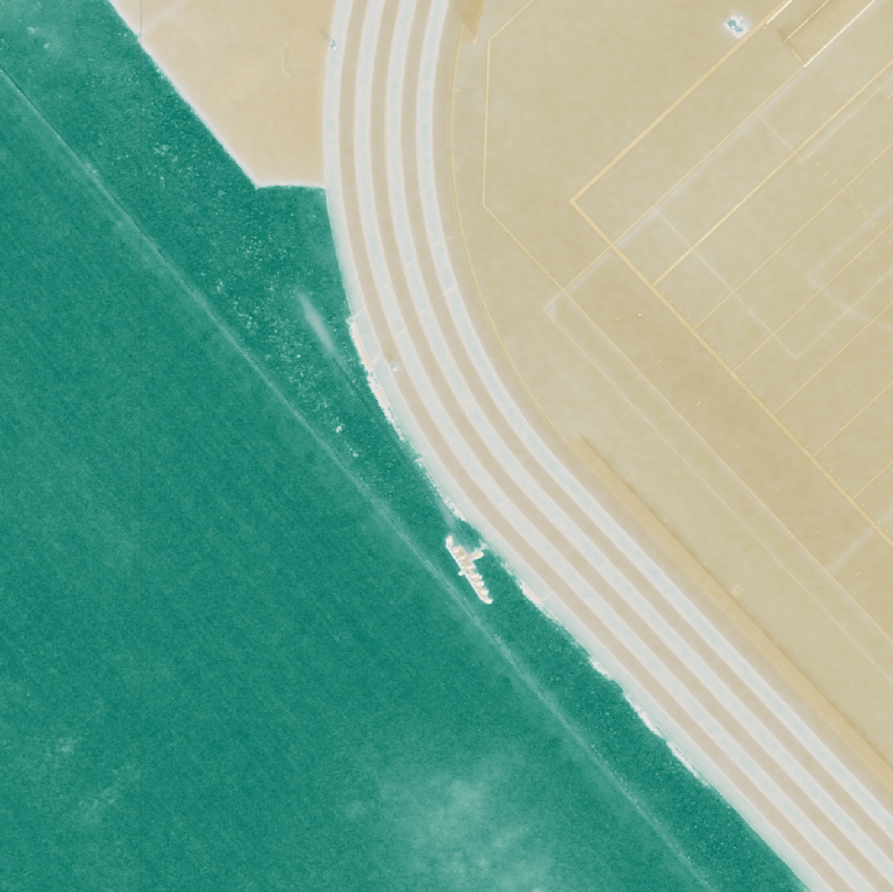

## What is NDVI?

NDVI stands for Normalized Difference Vegetation Index and is derived by doing some fancy math on specific wavelengths of light that bounces off of Earth's surface. More specifically, it uses a Near Infrared (NIR) wavelength of light (which we cannot see) and the red wavelength (which we can) in the following formula to output NDVI.

::: text-align
$NDVI = (NIR - red) / (NIR + red)$
:::

The value of NDVI, between -1 and +1, can tell us about the 'greenness' or 'health' of vegetation. I put these words in brackets because it ultimately is just a number, but it certainly helps us with assessing the general location and health of vegetation.

In order to get NDVI, we need to introduce a fourth part of the electromagnetic spectrum, NIR. Think about it as a new 'color'. Below is a picture in your classic red, green and blue pixels RGB.

Looks pretty normal to me. Now lets change which wavelength is represented as by each pixel. I am going to change the red to green, the green to blue, and the blue to NIR. The same picture becomes:

Now, were not seeing NDVI here yet, but by visualizing this NIR wavelength, we can really see that the vegetation really pops out! Why?

## Glowing Plants

Plants reflect a huge amount of light in the near-infrared wavelength, a lot more than other things like pavement, roofs, or soil. This reflection is caused by the structure of the leaves and needles; the chlorophyll absorbs most of the red light, and the NIR is reflected by the plants cell walls, otherwise it would overheat. NDVI takes advantage of this difference. Lets see it.

Now admittedly, we could distinguish between plant and non-plant pretty easily without having to do any raster math, but in this final NDVI image, we can see that the houses are brown, representing a more negative value nearing negative 1 and the vegetation as green, a more positive number nearing one.

Another example below shows how NDVI can help distinguish seamingly similar substances. One might think that both the sports field and the neighbouring field are both lushious and well kept terrain, but with the NDVI goggles, we can clearly see that the sports field is either really unhealthy grass, or more realistically, turf.

## Why do we care?

NDVI is one of the simplest things you can compute from remotely sensed imagery and it’s also one of the most powerful. With just these two wavelengths you can:

-   Detect vegetation location

-   Monitor vegetation health

-   Track seasonal change

-   Highlight vegetation vs. built environments

-   Detect disturbances (fire, harvest, storms)
